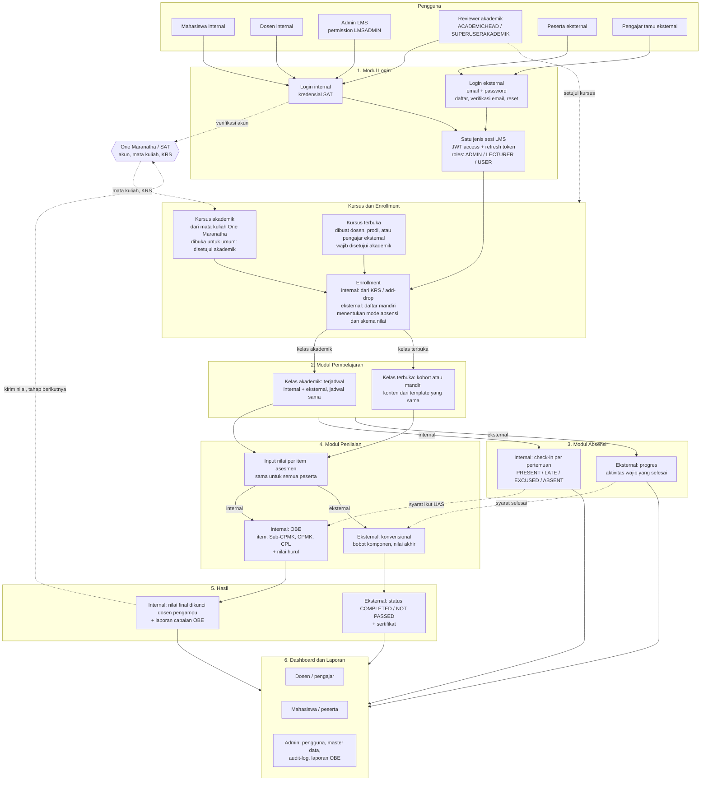
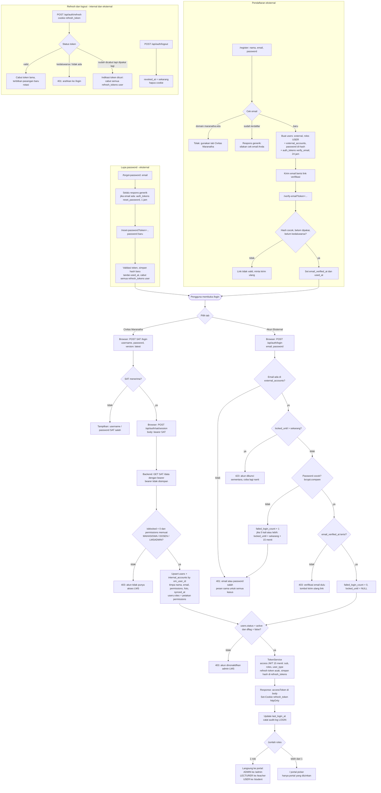
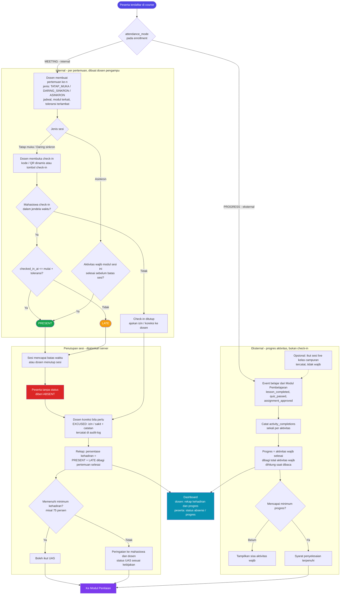
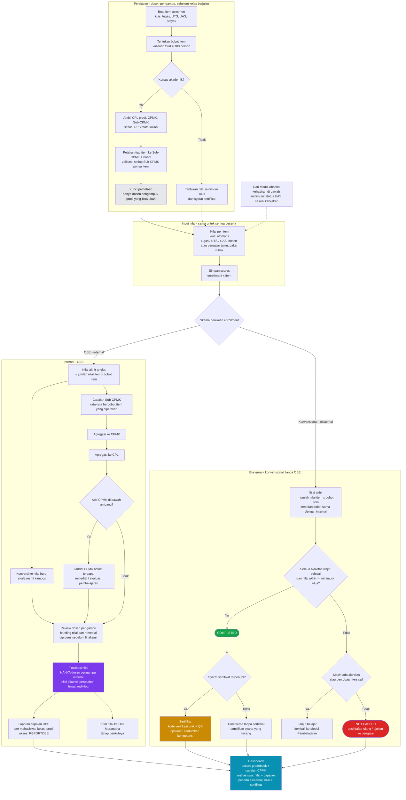

# Flowchart LMS Universitas Kristen Maranatha

Render di GitHub, VS Code (ekstensi *Markdown Preview Mermaid Support*), atau tempel tiap blok ke https://mermaid.live.

## 0. Gambaran Besar Seluruh Fitur

## 1. Modul Login (Internal & Eksternal)

## 2. Modul Pembelajaran (Persetujuan Kursus, Kelas Akademik & Kelas Terbuka)

```mermaid
%% Maranatha LMS — 2. Modul Pembelajaran (v3: + persetujuan kursus oleh akademik)
%% Prinsip: pacing ditetapkan PER KELAS, bukan per orang.
%%   Kelas akademik = terjadwal, boleh campuran internal + eksternal.
%%   Belajar mandiri = kelas terbuka terpisah yang memakai ulang konten dari template.
flowchart TD

  %% ───────── PEMBUATAN & PERSETUJUAN KELAS ─────────
  OMK["Mata kuliah dari One Maranatha"] --> KA{"Dibuka untuk umum?"}
  KA -- "Tidak, internal saja" --> K1["Kelas akademik<br/>pacing = SCHEDULED<br/>tanpa persetujuan tambahan"]
  KA -- "Ya, diajukan dosen pengampu / prodi" --> C1
  NEW(["Buat kursus terbuka baru"]) --> C0

  subgraph BUAT["Pembuatan dan persetujuan - reviewer: ACADEMICHEAD / SUPERUSERAKADEMIK"]
    direction TB
    C0{"Siapa pembuat kursus terbuka?"}
    C0 -- "Dosen internal / prodi" --> C1
    C0 -- "Pengajar eksternal" --> CV{"Akun sudah diverifikasi<br/>sebagai pengajar eksternal?"}
    CV -- Tidak --> CV1["Belum bisa membuat kursus<br/>ajukan verifikasi pengajar ke akademik"]
    CV -- Ya --> C1
    C1["Susun draft dari template<br/>modul, materi, tugas, bank soal<br/>audience tiap aktivitas<br/>status DRAFT"] --> C3["Ajukan persetujuan<br/>status MENUNGGU_PERSETUJUAN"]
    C3 --> C4{"Reviewer akademik<br/>tidak boleh menyetujui kursus buatannya sendiri"}
    C4 -- Tolak --> C5["DITOLAK + catatan<br/>kembali ke DRAFT"]
    C5 --> C1
    C4 -- Setujui --> C6["DIPUBLIKASI"]
    C6 --> C7{"Perubahan setelah publikasi"}
    C7 -- "Perbaikan materi" --> C8["Langsung berlaku<br/>tercatat di audit-log"]
    C7 -- "Judul, deskripsi,<br/>syarat kelulusan, sertifikat" --> C9["Change request<br/>versi lama tetap tayang"]
    C9 --> C10{"Reviewer menyetujui perubahan?"}
    C10 -- Ya --> C11["Perubahan diterapkan"]
    C10 -- Tidak --> C12["Ditolak + catatan<br/>versi lama tetap berlaku"]
  end

  C6 --> KT{"Jenis kelas yang dipublikasi"}
  KT -- "Mata kuliah dibuka untuk umum" --> K1b["Kelas akademik campuran<br/>pacing = SCHEDULED<br/>keputusan BAA: eksternal ikut jadwal atau mandiri"]
  KT -- "Kursus terbuka" --> K2{"Pacing kursus terbuka"}
  K2 -- "Kohort" --> K3["Kelas terbuka terjadwal<br/>tanggal mulai dan selesai sendiri"]
  K2 -- "Mandiri" --> K4["Kelas terbuka mandiri<br/>pacing = SELF_PACED<br/>access_days per peserta<br/>kuis pakai soal acak dari bank"]

  K1 --> START
  K1b --> START
  K3 --> START
  K4 --> START

  %% ───────── MASUK KELAS ─────────
  START(["Peserta membuka kelas"]) --> B{"Terdaftar di kelas?"}
  B -- Tidak --> B1([Access Denied])
  B -- Ya --> FIL["Server memfilter aktivitas<br/>sesuai participant_type vs audience<br/>aktivitas yang tidak sesuai tidak dikirim API"]
  FIL --> PACE{"Pacing kelas"}

  %% ───────── TERJADWAL (AKADEMIK / KOHORT) ─────────
  PACE -- "SCHEDULED" --> S1
  subgraph SCH["Terjadwal - semua peserta mengikuti jadwal yang sama, termasuk kelas campuran"]
    direction TB
    S1{"Modul sudah dibuka<br/>sesuai jadwal pertemuan?"} -- Belum --> S2["Tampilkan jadwal buka modul"]
    S1 -- Ya --> S3["Pelajari materi dan video<br/>ikut diskusi forum<br/>forum hanya menampilkan nama"]
    S3 --> S4{"Ada tugas / kuis?"}
    S4 -- Tidak --> S11
    S4 -- Ya --> S5{"Dikumpulkan sebelum deadline?"}
    S5 -- Ya --> S6["Tersimpan<br/>kuis: dinilai otomatis<br/>tugas: menunggu penilaian"]
    S5 -- Tidak --> S7{"Kebijakan keterlambatan"}
    S7 -- "Diterima" --> S8["Tersimpan, ditandai TERLAMBAT<br/>penalti sesuai kebijakan"]
    S7 -- "Ditolak" --> S9["Tidak bisa mengumpulkan<br/>nilai item = 0"]
    S6 --> S10["Setelah deadline:<br/>pembahasan kuis dibuka untuk semua"]
    S8 --> S10
    S9 --> S10
    S10 --> S11{"Masih ada pertemuan?"}
    S11 -- Ya --> S1
    S11 -- Tidak --> S12["Akhir periode kelas<br/>kelas diarsipkan, read-only<br/>untuk internal dan eksternal"]
  end

  %% ───────── MANDIRI (KELAS TERBUKA) ─────────
  PACE -- "SELF_PACED" --> E1
  subgraph SELF["Mandiri - hanya di kelas terbuka"]
    direction TB
    E1{"Akses masih berlaku?<br/>sekarang &lt;= access_ends_at"} -- Tidak --> E2(["Akses berakhir<br/>hasil tetap bisa dilihat"])
    E1 -- Ya --> E3["Pilih aktivitas<br/>sistem menyarankan aktivitas wajib berikutnya"]
    E3 --> E4{"Modul terbuka?<br/>prasyarat modul sebelumnya terpenuhi"}
    E4 -- Tidak --> E5["Modul terkunci, tampilkan alasan"]
    E5 --> E3
    E4 -- Ya --> E6{"Jenis aktivitas"}
    E6 -- "Materi / Video" --> E7{"Aturan selesai terpenuhi?"}
    E7 -- Belum --> E8["Simpan posisi terakhir"]
    E8 --> E3
    E7 -- Ya --> E9["Catat activity_completions"]
    E6 -- "Kuis" --> E10{"Skor &gt;= passing score?<br/>soal acak per percobaan"}
    E10 -- Ya --> E9
    E10 -- Tidak --> E11{"Sisa percobaan?"}
    E11 -- Ya --> E3
    E11 -- Tidak --> E12["Aktivitas wajib GAGAL permanen"]
    E6 -- "Tugas" --> E13["Submit, status MENUNGGU REVIEW<br/>peserta boleh lanjut aktivitas lain"]
    E13 -. "asinkron" .-> E14{"Pengajar: memenuhi kriteria?"}
    E14 -- Ya --> E9
    E14 -- Tidak --> E15{"Sisa revisi?"}
    E15 -- Ya --> E13
    E15 -- Tidak --> E12
    E9 --> E16{"Semua aktivitas wajib selesai?"}
    E16 -- Belum --> E3
  end

  %% ───────── KE MODUL LAIN ─────────
  S3 -. "event belajar" .-> ABS["Ke Modul Absensi<br/>internal: check-in pertemuan<br/>eksternal: progres"]
  E9 -. "event belajar" .-> ABS
  S6 --> NIL["Ke Modul Penilaian<br/>internal: OBE<br/>eksternal: konvensional"]
  S8 --> NIL
  S9 --> NIL
  S12 --> NIL
  E16 -- Ya --> NIL
  E12 --> NIL

  NOTE["Kelas campuran = kelas akademik dengan peserta eksternal.<br/>Jadwal sama untuk semua; yang berbeda hanya<br/>absensi dan skema nilai per enrollment.<br/>Laporan OBE hanya menghitung peserta internal."]
  K1b -.- NOTE

  style START fill:#4F46E5,color:#fff
  style C6 fill:#16A34A,color:#fff
  style C5 fill:#DC2626,color:#fff
  style FIL fill:#E5E7EB,color:#111
  style E12 fill:#DC2626,color:#fff
  style S9 fill:#DC2626,color:#fff
  style NIL fill:#7C3AED,color:#fff
  style ABS fill:#0891B2,color:#fff
  style NOTE fill:#FEF3C7,color:#111
```

## 3. Modul Absensi (Internal & Eksternal)

## 4. Modul Penilaian (OBE Internal & Konvensional Eksternal)

