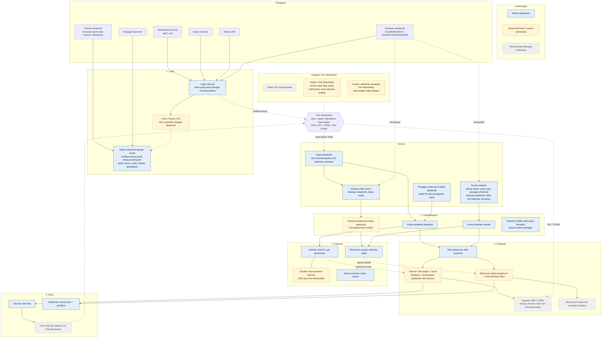
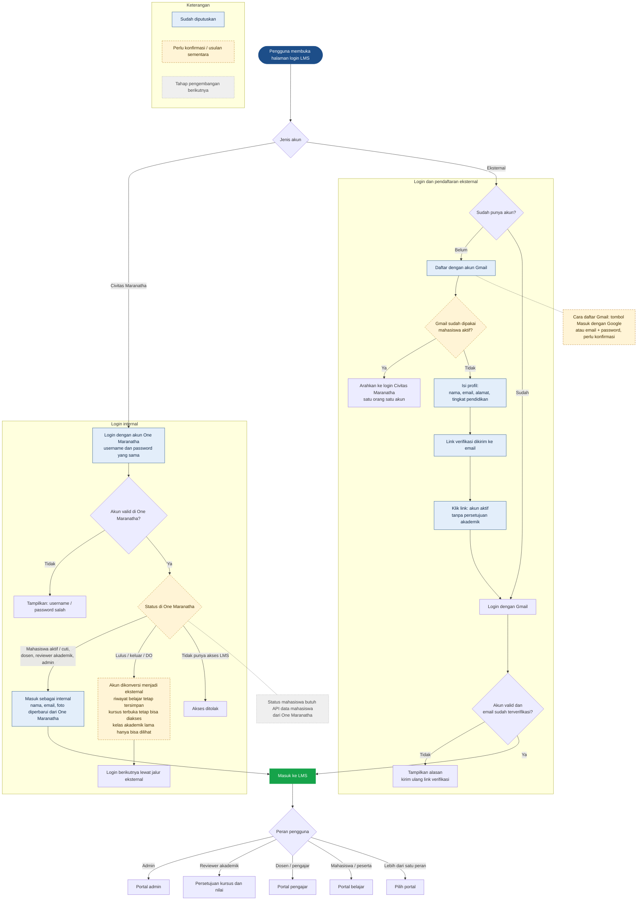
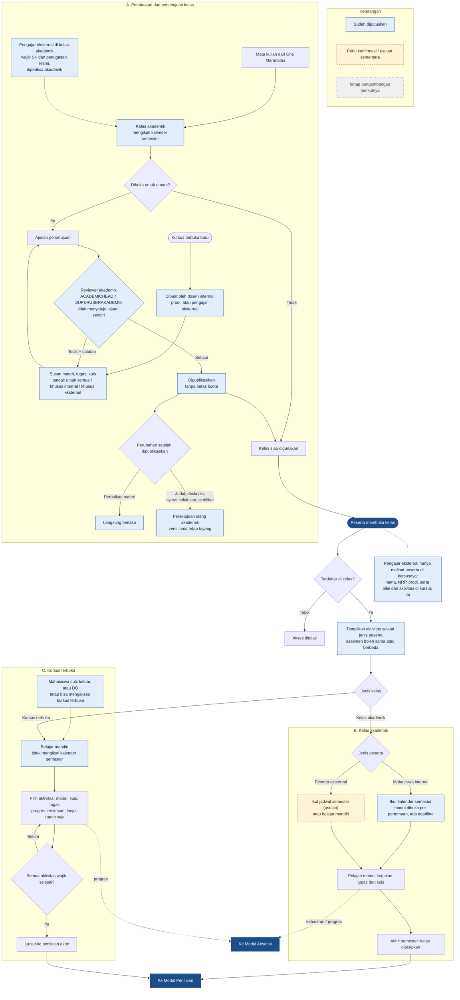
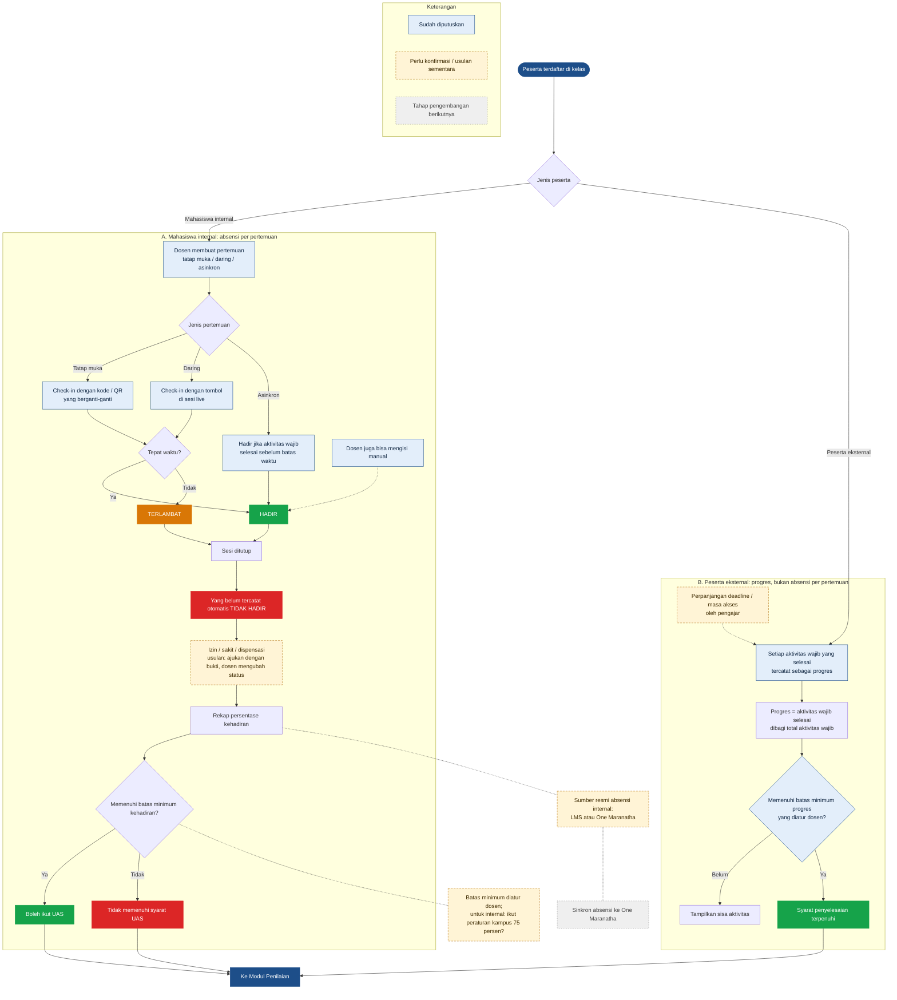
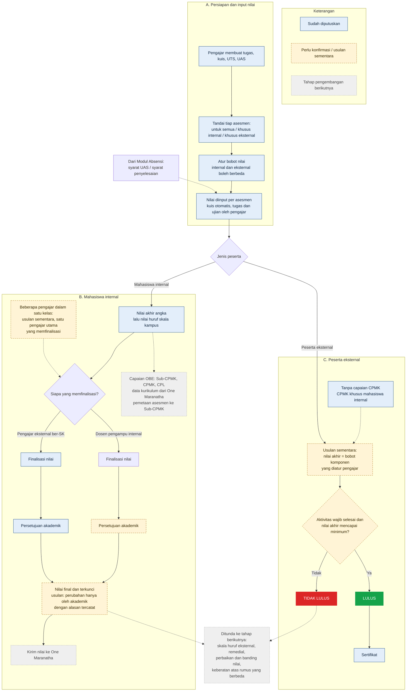
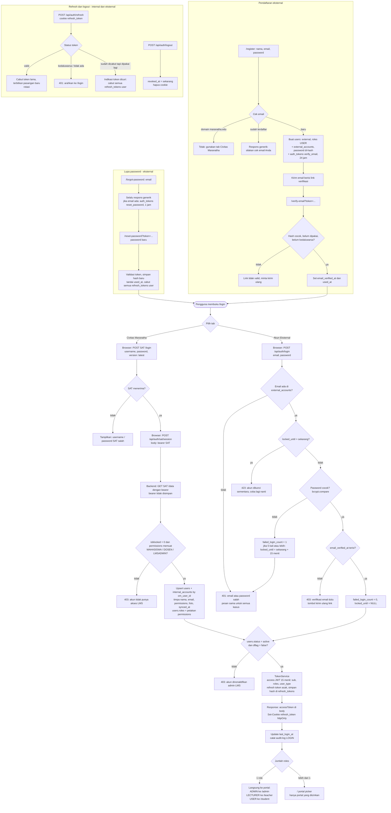

# learningmanagementsystem
Design sistem Learning Management System

## Flowchart LMS Universitas Kristen Maranatha

Status keputusan: **biru** = sudah diputuskan, **kuning putus-putus** = perlu konfirmasi / usulan sementara, **abu-abu** = tahap pengembangan berikutnya.

Render di GitHub, VS Code (ekstensi *Markdown Preview Mermaid Support*), atau tempel tiap blok ke https://mermaid.live.

### 0. Gambaran Besar

### 1. Modul Login

### 2. Modul Pembelajaran

### 3. Modul Absensi

### 4. Modul Penilaian

### Lampiran Teknis: Detail Login

